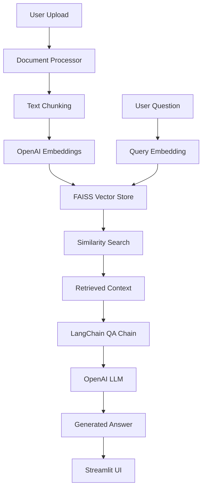

# 🤖 A_Team_Agent

A **framework-assisted RAG (Retrieval-Augmented Generation) application** with Streamlit UI, local FAISS vector storage, and OpenAI API integration.  
Built by the **A-Team** as a practical, deployable RAG solution combining simplicity with powerful frameworks.

---

## 🚀 Quick Start (2 Minutes Setup)

### **Option 1: Automated Setup (Recommended)**

**Windows:**
```bash
# 1. Clone the repository
git clone https://github.com/gabriele-fusi/A_Team_Agent.git
cd A_Team_Agent

# 2. Run setup script
setup.bat

# 3. Add your OpenAI API key to .env file
# 4. Start the application
setup_start.bat
```

**macOS/Linux:**
```bash
# 1. Clone the repository
git clone https://github.com/gabriele-fusi/A_Team_Agent.git
cd A_Team_Agent

# 2. Run setup script
chmod +x setup.sh start.sh
./setup.sh

# 3. Add your OpenAI API key to .env file
# 4. Start the application
./start.sh
```

### **Option 2: Manual Setup**

```bash
# 1. Clone and navigate
git clone https://github.com/gabriele-fusi/A_Team_Agent.git
cd A_Team_Agent

# 2. Create virtual environment
python -m venv .venv

# 3. Activate environment
# Windows:
.venv\Scripts\activate
# macOS/Linux:
source .venv/bin/activate

# 4. Install dependencies
pip install -r requirements.txt

# 5. Setup environment
cp .env.example .env
# Edit .env and add your OpenAI API key

# 6. Start the application
streamlit run app.py
```

### **Prerequisites**
- Python 3.8+ 
- OpenAI API key ([Get one here](https://platform.openai.com/api-keys))
- 2-4 GB RAM (for FAISS operations)

---

## 🎯 Project Overview

This is a **light app with framework assistance** that combines the best of both worlds:
- **Streamlit UI** for easy interaction and file uploads
- **LangChain framework** for streamlined RAG pipeline
- **Local FAISS** vector database for fast, cost-effective retrieval
- **OpenAI API** for embeddings and language generation
- **150-300 LOC** - manageable codebase with powerful capabilities

### Key Features
- 📁 **Document Upload & Processing** - Support for PDF, TXT, and Markdown files
- 🔍 **Intelligent Chunking** - Smart text splitting with overlap for better context
- 🧠 **Vector Embeddings** - OpenAI text-embedding-ada-002 for semantic search
- 💾 **Local FAISS Storage** - Fast, persistent vector index without cloud dependencies
- 💬 **Interactive Chat** - Streamlit-based chat interface with conversation history
- 🔄 **Streaming Responses** - Real-time answer generation for better UX
- 📊 **Source Attribution** - Shows which documents contributed to each answer

---

## 🛠️ Tech Stack

**Frontend:**
- [Streamlit](https://streamlit.io/) - Web UI framework
- Streamlit chat components for conversation interface

**RAG Framework:**
- [LangChain](https://python.langchain.com/) - RAG orchestration
- Document loaders (PDF, TXT, Markdown)
- Text splitters for intelligent chunking
- Retrieval chains for Q&A

**Vector Storage:**
- [FAISS](https://faiss.ai/) - Local vector database
- Persistent index storage
- Similarity search and retrieval

**AI APIs:**
- [OpenAI API](https://platform.openai.com/) - Embeddings & LLM
- text-embedding-ada-002 for vector embeddings
- GPT-4 or GPT-3.5-turbo for response generation

**Additional Libraries:**
- PyPDF2/pdfplumber for PDF processing
- python-dotenv for environment management
- streamlit-chat for enhanced chat UI

---

## 📂 Project Structure

```
├── app.py                   # Main Streamlit application
├── src/
│   ├── rag_pipeline.py      # LangChain RAG implementation
│   ├── document_processor.py # Document loading and chunking
│   ├── vector_store.py      # FAISS vector database management
│   └── config.py           # Configuration and settings
├── data/
│   ├── documents/          # Uploaded documents storage
│   └── vector_store/       # FAISS index files
├── requirements.txt        # Python dependencies
├── .env.example           # Environment variables template
├── README.md              # This file
└── tests/                 # Unit tests
```

---

## 🚀 Getting Started

### Prerequisites
- Python 3.8+
- OpenAI API key
- 2-4 GB RAM (for FAISS operations)

### Installation

1. **Clone the repository:**
```bash
git clone https://github.com/gabriele-fusi/A_Team_Agent.git
cd A_Team_Agent
```

2. **Install dependencies:**
```bash
pip install -r requirements.txt
```

3. **Set up environment variables:**
```bash
cp .env.example .env
# Edit .env and add your OpenAI API key
```

4. **Run the application:**
```bash
streamlit run app.py
```

### Usage

1. **Upload Documents:** Use the sidebar to upload PDF, TXT, or Markdown files
2. **Process Documents:** Click "Process Documents" to chunk and embed your files
3. **Ask Questions:** Use the chat interface to query your documents
4. **View Sources:** Each answer includes references to source documents

---

## 🏗️ Architecture



### Component Breakdown

**Document Processing Pipeline:**
1. **Upload** → Streamlit file uploader
2. **Parse** → LangChain document loaders  
3. **Chunk** → RecursiveCharacterTextSplitter
4. **Embed** → OpenAI embeddings API
5. **Store** → FAISS vector index

**Query Processing Pipeline:**
1. **Question** → User input via Streamlit
2. **Embed** → OpenAI embeddings API
3. **Search** → FAISS similarity search
4. **Retrieve** → Top-k relevant chunks
5. **Generate** → LangChain QA chain + OpenAI LLM
6. **Display** → Streamlit chat interface

---

## ⚙️ Configuration

### Key Settings (config.py)
```python
# Vector Store
CHUNK_SIZE = 1000
CHUNK_OVERLAP = 200
TOP_K_RETRIEVAL = 4

# OpenAI
EMBEDDING_MODEL = "text-embedding-ada-002"
LLM_MODEL = "gpt-3.5-turbo"
MAX_TOKENS = 500
TEMPERATURE = 0.7

# FAISS
INDEX_TYPE = "IndexFlatIP"  # Inner product for cosine similarity
SAVE_LOCAL = True
```

### Environment Variables (.env)
```bash
OPENAI_API_KEY=your_openai_api_key_here
STREAMLIT_SERVER_PORT=8501
LOG_LEVEL=INFO
```

---

## � Performance & Costs

### Expected Performance
- **Document Processing:** 1-2 minutes for 10MB PDF
- **Query Response:** 2-3 seconds average
- **Concurrent Users:** 5-10 (single instance)
- **Storage:** ~1MB per 1000 document chunks

### Cost Estimates (OpenAI API)
- **Embeddings:** ~$0.10 per 1M tokens
- **Chat Completion:** ~$2.00 per 1M tokens (GPT-3.5-turbo)
- **Typical Usage:** $5-20/month for moderate usage

---

## 🧪 Testing

Run the test suite:
```bash
python -m pytest tests/ -v
```

### Test Coverage
- Document processing and chunking
- Vector store operations
- RAG pipeline end-to-end
- Streamlit component integration

---

## 🚢 Deployment

### Local Development
```bash
streamlit run app.py --server.port 8501
```

### Streamlit Cloud
1. Push to GitHub
2. Connect to [Streamlit Cloud](https://streamlit.io/cloud)
3. Add OpenAI API key to secrets
4. Deploy automatically

### Docker
```bash
docker build -t a-team-agent .
docker run -p 8501:8501 --env-file .env a-team-agent
```

---

## 📚 Documentation

- 📖 [Development Guide](DEVELOPMENT.md) - Detailed development setup and workflow
- 🚀 [Deployment Guide](DEPLOYMENT.md) - Production deployment options  
- 🤝 [Contributing Guide](CONTRIBUTING.md) - How to contribute to the project
- 🔒 [Security Policy](SECURITY.md) - Security considerations and reporting

---

